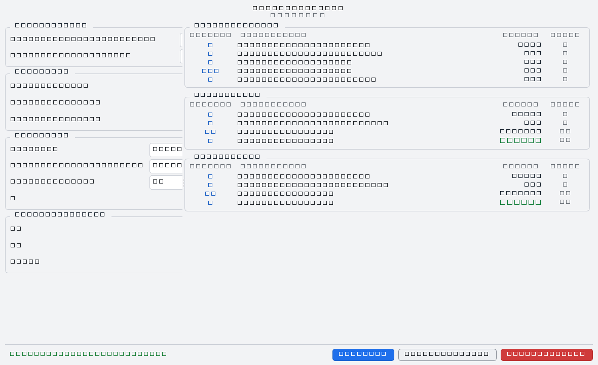

# Force sismique équivalente — RPS 2011

Calcul de la force sismique équivalente sur une structure, selon la **RPS 2011**
(Règles Parasismiques Algériennes, version 2011), en ligne de commande et avec
une interface graphique PySide6.



## Sommaire

- [Principe](#principe)
- [Installation](#installation)
- [Utilisation](#utilisation)
- [L'interface graphique](#linterface-graphique)
- [La note de calcul](#la-note-de-calcul)
- [Arborescence](#arborescence)
- [La procédure de calcul](#la-procédure-de-calcul)
- [Le modèle de données](#le-modèle-de-données)
- [Tests](#tests)
- [Licence](#licence)
- [Points d'attention](#points-dattention)

## Principe

La formule mise en œuvre est la méthode de la force statique équivalente :

```
F = υ.I.D.S.W / K
```

| Symbole | Désignation | Origine |
|---------|-------------|---------|
| `υ` | Coefficient de vitesse | Tableau 5.1 |
| `I` | Coefficient d'importance | Tableau 3.1 |
| `D` | Facteur d'amplification | Tableau 5.3 |
| `S` | Coefficient de site | Tableau 5.2 |
| `W` | Poids sismique du bâtiment | Donnée d'entrée |
| `K` | Facteur de comportement | Tableau 3.3 |

Le calcul est effectué dans les deux directions **X** et **Y** ; chaque valeur
intermédiaire conserve sa formule, son unité et la table de la norme dont elle
est issue, et le résultat est vérifiable ligne à ligne.

## Installation

Python 3.12 ou plus récent (testé sur 3.14). Le cœur du projet n'a **aucune
dépendance** : la bibliothèque et la ligne de commande fonctionnent avec la
seule bibliothèque standard.

```bash
git clone <url-du-depot>
cd force-sismique
python -m pip install -e ".[gui,latex,dev]"
```

Les extras sont facultatifs et indépendants :

| Extra | Apport | Installation seule |
|-------|--------|--------------------|
| `gui` | Interface graphique | `pip install PySide6` |
| `latex` | Rendu LaTeX de la formule (`interface/formule.py`) | `pip install matplotlib` |
| `dev` | Tests et analyse statique | `pip install pytest pyflakes` |

Sans `latex`, le rendu de la formule bascule sur une version texte enrichie.
Sans `gui`, la ligne de commande et la bibliothèque restent pleinement
fonctionnelles.

## Utilisation

### Ligne de commande

```bash
python main.py                # exemple complet + bilan détaillé
python affichage.py           # même bilan, lancé depuis la couche présentation
```

`main.py` et `affichage.py` reconfigurent `sys.stdout` en UTF-8 : la console
Windows par défaut (cp437 / cp1252) ne sait pas afficher `υ`, `≤` ou `×`.

```
==============================================================================
              CALCUL DE LA FORCE SISMIQUE ÉQUIVALENTE — RPS 2011
                               F = υ.I.D.S.W/K
==============================================================================

DONNÉES D'ENTRÉE
------------------------------------------------------------------------------
  Localisation
    Zone d'accélération Za = 4 (ZONE_4)
    Zone de vitesse     Zv = 3 (ZONE_3)
  ...
PARAMÈTRES RPS
------------------------------------------------------------------------------
  Sym   Désignation                           Valeur Unité Source
  υ     Coefficient de vitesse                  0.13 -     RPS 2011 - Tableau 5.1
  I     Coefficient d'importance                   1 -     RPS 2011 - Tableau 3.1
  S     Coefficient de site                      1.2 -     RPS 2011 - Tableau 5.2
  ND1   Niveau de ductilité                      ND1 -     RPS 2011 - Tableau 3.2
  K     Facteur de comportement                    2 -     RPS 2011 - Tableau 3.3
...
RÉSULTATS
------------------------------------------------------------------------------
  Sym   Désignation                           Valeur Unité
  Direction X
  T        Période fondamentale X                  0.42 s
  D        Facteur d'amplification X                2.4 -
  F        Force sismique X                      582.68 kN
```

### Bibliothèque

```python
from rps import (
    Batiment, ClasseConstruction, ClasseSite, PoidsSismiques,
    SystemeContreventement, Unite, calcul_force_sismique,
    creer_geometrie, creer_localisation, saisir_charge,
)

resultats = calcul_force_sismique(
    localisation=creer_localisation(Za=4, Zv=3),
    geometrie=creer_geometrie(hauteur=10.0, longueur_x=20.0, longueur_y=15.0),
    batiment=Batiment(
        type_ossature=SystemeContreventement.PORTIQUE_BA,
        classe=ClasseConstruction.CLASSE_III,
        classe_site=ClasseSite.S2,
    ),
    loads=PoidsSismiques(
        Wx=saisir_charge("Poids sismique X", symbole="Wx", unite=Unite.kN, valeur=3111.61),
        Wy=saisir_charge("Poids sismique Y", symbole="Wy", unite=Unite.kN, valeur=3111.61),
    ),
)

resultats.Fx.valeur      # 582.6782...
resultats.Fx.unite       # Unite.kN
resultats.Fx.formule     # 'F = υ.I.D.S.W/K'
resultats.S.source       # <Source.COEFF_SITE: 'RPS 2011 - Tableau 5.2'>
```

## L'interface graphique

```bash
python -m interface         # ou : python lancer_interface.py
```

La fenêtre est organisée en trois zones :

- **En-tête** — « Force sismique — RPS 2011 » ;
- **Entrées** — quatre groupes : Localisation (Za, Zv), Géométrie (H, Lx, Ly),
  Structure (ossature, classe, classe de site, S) et Poids sismiques
  (Wx, Wy, unité). Chaque groupe est une grille à deux colonnes : les libellés
  sont étirables, les champs de largeur fixe alignés à droite (115 px pour les
  valeurs, 120 px pour les zones et l'unité, 180 px pour la structure). Une
  valeur à `0.00` signifie « non renseigné » ;
- **Résultats** — un `QScrollArea` hosting trois tableaux ordonnés
  (« Paramètres RPS », « Direction X », « Direction Y »), colonnes
  *Symbole / Désignation / Valeur / Unité*. Chaque cellule est un `QLabel`
  (les forces `Fx` et `Fy` sont mises en avant) ; le texte provient des mêmes
  aides de formatage que le terminal.

Le champ **S** affiche la valeur forfaitaire de la classe de site choisie
(1.0, 1.2, 1.4, 1.8) et n'est saisissable que pour **S5**, qui exige une étude
géotechnique.

La barre d'actions, en bas, suit l'ordre « état, `Calculer`, `Note de calcul`,
`Réinitialiser` » : le message d'état occupe la gauche, les boutons la droite.

### Contrôle des données

La barre d'état ne signale rien tant que `Calculer` n'a pas été cliqué : elle
affiche alors « Renseignez les données puis cliquez sur Calculer. ».

Pendant la saisie, le **champ en cours de modification** passe en rouge
(bordure et texte) dès que sa valeur est refusée, sans toucher à l'état.

Au clic sur `Calculer`, la fenêtre vérifie le formulaire :

| Cas | Message | Couleur |
|-----|---------|---------|
| Champs fautifs | `Les valeurs saisies sont erronées : H, Lx, Ly, Wx, Wy` | rouge |
| Calcul réussi | `Calcul réalisé avec succès` | vert |
| Note enregistrée | `Note de calcul exportée : note_de_calcul_….txt` | vert |
| Export annulé | `Export annulé.` | orange |
| Reprise de la saisie après un calcul | `Données modifiées — cliquez sur Calculer…` | gris |

Les champs fautifs restent soulignés en rouge jusqu'à ce qu'ils soient
renseignés. Un refus du domaine qui ne dépend pas d'un champ — par exemple une
combinaison absente du tableau 3.3 — affiche directement son message.

### Journal des interactions

Chaque ouverture de session, saisie de champ, changement de classe de site,
calcul, export, réinitialisation, refus ou avertissement est journalisé dans
`logs/interface.log` (512 Kio, 3 fichiers conservés, encodage UTF-8). Les
`WARNING` et `ERROR` du domaine `rps` sont relayés dans la barre d'état : une
valeur de repli de tableau signale directement l'utilisateur, par exemple
`Coefficient interpolé` en orange.

L'interface ne duplique aucune règle de calcul : elle appelle
`calcul_force_sismique()` et se contente de traduire les widgets en objets du
domaine.

## La note de calcul

Le bouton **Note de calcul** ouvre une fenêtre dédiée qui affiche le texte
exactement tel qu'il sera enregistré, précédé de la date et de l'heure de
réalisation du calcul :

```
==============================================================================
              CALCUL DE LA FORCE SISMIQUE ÉQUIVALENTE — RPS 2011
                               F = υ.I.D.S.W/K
==============================================================================
Calcul réalisé le 26/09/2026 à 21:57:47

DONNÉES D'ENTRÉE
...
```

Le bouton **Enregistrer sous…** de cette fenêtre ouvre une boîte de dialogue et
écrit la note dans un fichier `.txt` en UTF-8, avec horodatage par défaut
(`note_de_calcul_AAAAMMJJ_HHMMSS.txt`). Le texte provient de
`affichage.rendre_bilan()`.

## Arborescence

```
affichage.py           Couche présentation : en-tête, entrées, paramètres, résultats
main.py                Point d'entrée : exemple(), executer()
lancer_interface.py    Raccourci : ouvre la fenêtre PySide6
generer_apercu.py      Régénère docs/apercu.png depuis l'interface
pyproject.toml         Métadonnées, extras et configuration de pytest
data/                  Catalogue des vitesses et zones sismiques par commune
docs/                  Aperçu de l'interface
rps/                   Package : tout le domaine métier
  utils.py               Enums, Params, ZoneSismique, Geometrie
  parametre.py           Resultats (output du calcul)
  calcul_sismique.py     La procédure complète + Batiment, PoidsSismiques
  charge.py              Saisie des charges (poids sismiques)
  zone_sismique.py       υ  — coefficient de vitesse          (Tableau 5.1)
  importance.py          I  — coefficient d'importance       (Tableau 3.1)
  site_sismique.py       S  — coefficient de site             (Tableau 5.2)
  ductilite.py           ND — niveau de ductilité             (Tableau 3.2)
  comportement.py        K  — facteur de comportement         (Tableau 3.3)
  amplification.py       D  — facteur d'amplification        (Tableau 5.3)
  periode.py             T  — période fondamentale de vibration
  force_sismique.py      F  — la formule
  __init__.py            API publique du package
interface/             Interface graphique PySide6
  __main__.py            python -m interface
  app.py                 QApplication, feuilles de style clair/sombre, point d'entrée
  fenetre.py             Fenêtre : en-tête, saisie, résultats, barre d'actions
  saisie.py              Formulaire : champs, validation, signal de changement
  resultats.py           Panneau de résultats (chaque valeur est un widget)
  note.py                Fenêtre d'affichage de la note de calcul
  journal.py             Journal rotatif + relais des erreurs vers la barre d'état
  formule.py             Rendu LaTeX de la formule (matplotlib mathtext)
tests/                 34 tests, dont l'interface en mode headless
```

## La procédure de calcul

`calcul_force_sismique(localisation, geometrie, batiment, loads)` enchaîne les
étapes suivantes et renvoie un objet `Resultats`.

### 1. Données d'entrée

| Objet | Contenu |
|-------|---------|
| `ZoneSismique` | `za` (zone d'accélération), `zv` (zone de vitesse) |
| `Geometrie` | `hauteur` (H), `longueur_x` (Lx), `longueur_y` (Ly) |
| `Batiment` | `type_ossature`, `classe`, `classe_site`, `coef_site_manuel` |
| `PoidsSismiques` | `Wx`, `Wy` (poids sismiques, en `Params`) |

Les constructeurs `creer_localisation()` et `creer_geometrie()` valident les
données (zone dans 0-4, dimensions strictement positives) et lèvent
`ValueError` sinon. `saisir_charge()` valide l'unité (kN, daN, kgf) et impose une
valeur strictement positive.

### 2. `υ` — coefficient de vitesse

`coefficient_vitesse(zv)` — Tableau 5.1.

| Zone | ZONE_0 | ZONE_1 | ZONE_2 | ZONE_3 | ZONE_4 |
|------|--------|--------|--------|--------|--------|
| υ | 0.00 | 0.07 | 0.10 | 0.13 | 0.17 |

Une zone hors tableau est journalisée en `warning` et la valeur maximale
`υ = 0.17` est retenue, avec une `remarque` dans le `Params` retourné.

### 3. `I` — coefficient d'importance

`coefficient_importance(classe)` — Tableau 3.1.

| Classe | Classe I | Classe II | Classe III |
|--------|----------|------------|------------|
| I | 1.30 | 1.20 | 1.00 |

### 4. `T` — période fondamentale de vibration

`calcul_periode(hauteur, longueur, type_ossature, direction)` :

| Système de contreventement | Formule |
|----------------------------|----------|
| Portique BA, ossature acier contreventée | `T = 0.075 × H^(3/4)` |
| Portique acier à nœuds rigides | `T = 0.085 × H^(3/4)` |
| Voiles (portique+voile, voile, voiles couplés) | `T = 0.09 × H / L^(0.5)` |

`L` est la longueur dans la direction considérée : `longueur_x` pour X,
`longueur_y` pour Y.

### 5. `D` — facteur d'amplification

`facteur_amplification(zone_acceleration, zone_vitesse, T, direction)` —
Tableau 5.3. La valeur dépend de la comparaison des zones, équivalente à la
comparaison du rapport Za/Zv à 1 :

| Za/Zv | T ≤ 0.25 | 0.25 < T < 0.50 | T ≥ 0.50 |
|-------|----------|------------------|----------|
| < 1 | 1.9 | 1.9 | 1.2 / T^(2/3) |
| = 1 | 2.5 | −2.4T + 3.1 | 1.2 / T^(2/3) |
| > 1 | 3.5 | −6.4T + 5.1 | 1.2 / T^(2/3) |

### 6. `S` — coefficient de site

`coefficient_site(classe_site, valeur_manuelle)` — Tableau 5.2.

| Classe | S1 | S2 | S3 | S4 | S5 |
|--------|----|----|----|----|----|
| S | 1.0 | 1.2 | 1.4 | 1.8 | étude géotechnique |

Le site **S5** n'a pas de valeur forfaitaire : la fonction lève `ValueError` si
`valeur_manuelle` n'est pas fournie. Cette valeur se renseigne via
`Batiment.coef_site_manuel`.

### 7. `ND` — niveau de ductilité

`niveau_ductilite(classe, coef_vitesse)` — Tableau 3.2.

| Classe | υ ≤ 0.10 | υ ≤ 0.20 | υ > 0.20 |
|--------|----------|----------|----------|
| I ou II | ND1 | ND2 | ND3 |
| III | ND1 | ND1 | ND2 |

### 8. `K` — facteur de comportement

`facteur_comportement(nd, ossature)` — Tableau 3.3.

| Système de contreventement | ND1 | ND2 | ND3 |
|----------------------------|-----|-----|-----|
| Portique BA | 2.0 | 3.5 | 5.0 |
| Portique et voile BA | 2.0 | 3.0 | 4.0 |
| Voile BA | 1.4 | 2.1 | 2.8 |
| Voiles couplés BA | 1.8 | 2.5 | 3.5 |
| Portique acier à nœuds rigides | 3.0 | 4.5 | 6.0 |
| Ossature acier contreventée | 2.0 | 3.0 | 4.0 |

### 9. `F` — force sismique

`force_sismique(v, I, D, S, W, K)` applique `F = υ.I.D.S.W / K`, une fois par
direction. `force_params()` encapsule le résultat dans un `Params` dont l'unité
est celle du poids `W` utilisé.

## Le modèle de données

### `Params`

Conteneur unique de toute valeur calculée (dataclass gelée) :

| Champ | Rôle |
|-------|------|
| `nom` | Désignation affichée |
| `symbole` | Symbole affiché (`υ`, `I`, `S`, `K`, `T`, `D`, `F`…) |
| `valeur` | Valeur numérique, ou `Enum` pour `nd` |
| `unite` | `str` (`"-"`, `"s"`) ou `Unite` (`Unite.kN`…) |
| `description` | Explication du paramètre |
| `formule` | Formule appliquée, avec les valeurs substituées |
| `source` | Table de la RPS 2011 d'où vient la valeur |
| `remarque` | Avertissement (valeur de repli, valeur manuelle…) |

### `Resultats`

Les 13 attributs de la procédure sont **tous** des `Params` : `upsilon`, `I`,
`S`, `nd`, `K`, `Tx`, `Ty`, `Dx`, `Dy`, `Wx`, `Wy`, `Fx`, `Fy`. Aucun n'est
optionnel : un `Resultats` est toujours complet et entièrement traçable.

### Enums

- `ZoneAcceleration` (0-4), `ZoneVitesse` (0-4) : zonage de la RPS
- `ClasseConstruction` (I, II, III), `ClasseSite` (S1-S5)
- `SystemeContreventement` : portique, voile, ossature acier
- `NiveauDuctilite` (ND1-ND3)
- `Unite` : kN, daN, kgf, t, s, m
- `Source` : la table de la RPS 2011 dont provient une valeur

## Affichage

`affichage.py` fournit une fonction par section, toutes appelables
indépendamment :

| Fonction | Sortie |
|----------|--------|
| `afficher_entete()` | titre et formule encadrés |
| `afficher_donnees_entree()` | localisation, géométrie, structure, charges |
| `afficher_parametres_rps()` | υ, I, S, ND, K avec leur table source |
| `afficher_resultats()` | T, D et F, par direction |
| `afficher_bilan()` | enchaîne les quatre sections |

Chaque section existe en deux formes : `afficher_x()` écrit sur la sortie
standard, `rendre_x()` retourne la même mise en forme sous forme de chaîne —
c'est cette seconde forme que consomment la ligne de commande et l'interface
graphique.

`main.py` ne fait que construire les données d'entrée (`exemple()`), appeler la
procédure (`executer()`) et déléguer l'affichage.

## Tests

```bash
python -m pytest          # 34 tests
python -m pytest -v
python -m pyflakes .      # analyse statique
```

| Fichier | Couverture |
|---------|------------|
| `test_zone_sismique.py` | υ par zone |
| `test_importance.py` | I par classe |
| `test_site.py` | S par classe, S5 avec et sans valeur manuelle |
| `test_ductilite.py` | ND par classe et par υ |
| `test_comportement.py` | K par ossature et par niveau |
| `test_amplification.py` | D aux seuils de T et selon Za/Zv |
| `test_periode.py` | T (valeur, unité, formule) |
| `test_interface.py` | Barre d'actions, contrôle des données, résultats en widgets, note de calcul, journal, export |

`test_interface.py` force `QT_QPA_PLATFORM=offscreen` : il se lance donc sans
écran. `charge.py` et `calcul_sismique.py` ne sont pas encore couverts par des
tests unitaires directs (ils le sont indirectement via `test_interface.py`).

L'aperçu du README se régénère avec :

```bash
python generer_apercu.py    # écrit docs/apercu.png
```

## Licence

MIT — voir [LICENSE](LICENSE).

## Points d'attention

- **Pas de conversion d'unité** : `W` et `F` partagent l'unité déclarée dans
  `saisir_charge`. Convertir les poids en kN est de la responsabilité de
  l'appelant.
- **`facteur_amplification` compare des indices de zones** (0-4), pas le rapport
  Za/Zv lui-même ; les trois cas du tableau 5.3 sont obtenus par comparaison.
- **`ZoneSismique` et `Geometrie` ne sont pas des dataclass** (pas d'égalité ni
  de représentation automatique), contrairement à `Params`, `Batiment`,
  `PoidsSismiques` et `Resultats`.
- **Le coefficient de comportement de `VOILE_COUPLE_BA` en ND3 n'existe pas** :
  la combinaison lève `ValueError`.
- **Le catalogue `data/`** (`catalogue_vitesses_zones_sismiques.csv`) associe à
  chaque commune sa vitesse et ses zones sismiques ; c'est une donnée de
  référence, aucun code ne la lit.
- Le tableau du facteur d'amplification est celui de la RPS 2011 ; vérifier la
  version de la norme en vigueur sur votre projet.
